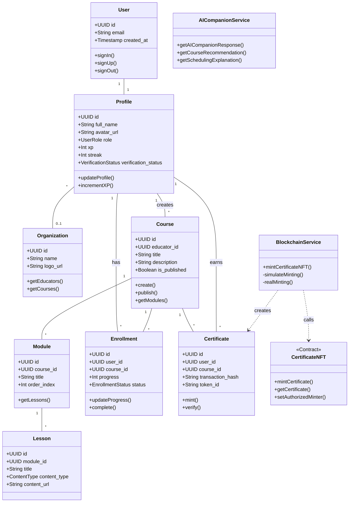

# SkillChain - Class Diagram

## 📊 Complete Class Diagram (PlantUML Format)

```plantuml
@startuml SkillChain_Class_Diagram

skinparam classAttributeIconSize 0
skinparam classFontSize 12
skinparam classBackgroundColor #F5F5F5
skinparam classBorderColor #333333
skinparam arrowColor #666666

' ============================================
' DOMAIN ENTITIES (Database Models)
' ============================================

package "Domain Entities" #E8F4FD {
    
    class User <<Entity>> {
        - id: UUID
        - email: string
        - encrypted_password: string
        - created_at: timestamp
        - updated_at: timestamp
        --
        + signIn(email, password): Session
        + signUp(email, password, metadata): User
        + signOut(): void
        + resetPassword(email): void
    }

    class Profile <<Entity>> {
        - id: UUID (FK → User)
        - full_name: string
        - avatar_url: string
        - role: UserRole
        - xp: number
        - streak: number
        - verification_status: VerificationStatus
        - professional_title: string
        - portfolio_url: string
        - org_id: UUID (FK → Organization)
        - created_at: timestamp
        - updated_at: timestamp
        --
        + updateProfile(data): Profile
        + incrementXP(amount): void
        + updateStreak(): void
        + verifyEducator(): void
    }

    class Organization <<Entity>> {
        - id: UUID
        - name: string
        - description: string
        - logo_url: string
        - website: string
        - contact_email: string
        - created_at: timestamp
        - updated_at: timestamp
        --
        + create(data): Organization
        + update(data): Organization
        + uploadLogo(file): string
        + getEducators(): Profile[]
        + getCourses(): Course[]
    }

    class OrgInviteCode <<Entity>> {
        - id: UUID
        - org_id: UUID (FK → Organization)
        - code: string
        - uses_remaining: number
        - expires_at: timestamp
        - created_by: UUID (FK → Profile)
        - created_at: timestamp
        --
        + generate(orgId, maxUses, expiresAt): OrgInviteCode
        + validate(code): boolean
        + use(code): Organization
    }

    class Course <<Entity>> {
        - id: UUID
        - educator_id: UUID (FK → Profile)
        - org_id: UUID (FK → Organization)
        - title: string
        - description: string
        - thumbnail_url: string
        - category: string
        - difficulty: DifficultyLevel
        - price: number
        - is_published: boolean
        - certificate_theme: string
        - created_at: timestamp
        - updated_at: timestamp
        --
        + create(data): Course
        + update(data): Course
        + publish(): void
        + unpublish(): void
        + getModules(): Module[]
        + getEnrollments(): Enrollment[]
    }

    class Module <<Entity>> {
        - id: UUID
        - course_id: UUID (FK → Course)
        - title: string
        - description: string
        - order_index: number
        - created_at: timestamp
        --
        + create(courseId, data): Module
        + update(data): Module
        + reorder(newIndex): void
        + getLessons(): Lesson[]
    }

    class Lesson <<Entity>> {
        - id: UUID
        - module_id: UUID (FK → Module)
        - title: string
        - content_type: ContentType
        - content_url: string
        - duration_minutes: number
        - order_index: number
        - created_at: timestamp
        --
        + create(moduleId, data): Lesson
        + update(data): Lesson
        + uploadContent(file): string
    }

    class Quiz <<Entity>> {
        - id: UUID
        - course_id: UUID (FK → Course)
        - module_id: UUID (FK → Module)
        - title: string
        - description: string
        - passing_score: number
        - time_limit_minutes: number
        - created_at: timestamp
        --
        + create(data): Quiz
        + getQuestions(): QuizQuestion[]
        + calculateScore(answers): number
    }

    class QuizQuestion <<Entity>> {
        - id: UUID
        - quiz_id: UUID (FK → Quiz)
        - question_text: string
        - question_type: QuestionType
        - options: JSON
        - correct_answer: string
        - points: number
        - order_index: number
        --
        + create(quizId, data): QuizQuestion
        + checkAnswer(answer): boolean
    }

    class Enrollment <<Entity>> {
        - id: UUID
        - user_id: UUID (FK → Profile)
        - course_id: UUID (FK → Course)
        - progress: number
        - status: EnrollmentStatus
        - enrolled_at: timestamp
        - completed_at: timestamp
        --
        + enroll(userId, courseId): Enrollment
        + updateProgress(progress): void
        + complete(): void
        + getProgress(): LessonProgress[]
    }

    class LessonProgress <<Entity>> {
        - id: UUID
        - enrollment_id: UUID (FK → Enrollment)
        - lesson_id: UUID (FK → Lesson)
        - is_completed: boolean
        - completed_at: timestamp
        - time_spent_seconds: number
        --
        + markComplete(): void
        + trackTime(seconds): void
    }

    class QuizAttempt <<Entity>> {
        - id: UUID
        - user_id: UUID (FK → Profile)
        - quiz_id: UUID (FK → Quiz)
        - score: number
        - passed: boolean
        - answers: JSON
        - started_at: timestamp
        - completed_at: timestamp
        --
        + start(userId, quizId): QuizAttempt
        + submitAnswers(answers): number
        + calculateScore(): number
    }

    class Certificate <<Entity>> {
        - id: UUID
        - user_id: UUID (FK → Profile)
        - course_id: UUID (FK → Course)
        - transaction_hash: string
        - token_id: string
        - metadata_uri: string
        - verification_code: string
        - issued_at: timestamp
        --
        + mint(userId, courseId): Certificate
        + verify(code): boolean
        + getMetadata(): CertificateMetadata
    }

    class StudyPlan <<Entity>> {
        - id: UUID
        - user_id: UUID (FK → Profile)
        - course_id: UUID (FK → Course)
        - title: string
        - scheduled_date: date
        - scheduled_time: time
        - duration_minutes: number
        - is_completed: boolean
        - created_at: timestamp
        --
        + create(data): StudyPlan
        + markComplete(): void
        + reschedule(date, time): void
    }

    class FocusSession <<Entity>> {
        - id: UUID
        - user_id: UUID (FK → Profile)
        - method: FocusMethod
        - duration_minutes: number
        - completed: boolean
        - tab_switch_count: number
        - focus_score: number
        - started_at: timestamp
        - ended_at: timestamp
        --
        + start(userId, method): FocusSession
        + end(tabSwitches): void
        + calculateFocusScore(): number
    }

    class Notification <<Entity>> {
        - id: UUID
        - user_id: UUID (FK → Profile)
        - type: NotificationType
        - title: string
        - message: string
        - data: JSON
        - read_at: timestamp
        - created_at: timestamp
        --
        + create(userId, type, title, message): Notification
        + markAsRead(): void
        + delete(): void
    }

    class AIPreferences <<Entity>> {
        - id: UUID
        - user_id: UUID (FK → Profile)
        - learning_goal: string
        - target_skill: string
        - skill_proficiency: number
        - study_hours_per_week: number
        - preferred_time: string
        - learning_style: LearningStyle
        - created_at: timestamp
        - updated_at: timestamp
        --
        + save(userId, data): AIPreferences
        + update(data): AIPreferences
    }
}

' ============================================
' ENUMERATIONS
' ============================================

package "Enumerations" #FFF3E0 {
    
    enum UserRole {
        LEARNER
        EDUCATOR
        ORG_ADMIN
        ADMIN
    }

    enum VerificationStatus {
        PENDING
        APPROVED
        REJECTED
    }

    enum DifficultyLevel {
        BEGINNER
        INTERMEDIATE
        ADVANCED
    }

    enum ContentType {
        VIDEO
        TEXT
        PDF
        INTERACTIVE
    }

    enum QuestionType {
        MULTIPLE_CHOICE
        TRUE_FALSE
        SHORT_ANSWER
    }

    enum EnrollmentStatus {
        ACTIVE
        COMPLETED
        DROPPED
    }

    enum FocusMethod {
        POMODORO
        DEEP_WORK
        TIME_BOXING
        FLOW_STATE
    }

    enum NotificationType {
        VERIFICATION_APPROVED
        VERIFICATION_REJECTED
        COURSE_ENROLLED
        CERTIFICATE_EARNED
        NEW_STUDENT
        COURSE_COMPLETED
        GENERAL
    }

    enum LearningStyle {
        VISUAL
        AUDITORY
        READING
        KINESTHETIC
    }
}

' ============================================
' SERVICE CLASSES
' ============================================

package "Services" #E8F5E9 {
    
    class AuthService <<Service>> {
        - supabase: SupabaseClient
        - user: User
        - session: Session
        --
        + signIn(email, password): Promise<void>
        + signUp(email, password, role, fullName, educatorInfo): Promise<void>
        + signOut(): Promise<void>
        + resetPassword(email): Promise<void>
        + updateProfile(): Promise<void>
        + getSession(): Session
        + getUser(): User
    }

    class BlockchainService <<Service>> {
        - provider: JsonRpcProvider
        - wallet: Wallet
        - contract: Contract
        - contractAddress: string
        --
        + mintCertificateNFT(studentAddress, studentName, courseTitle, metadataURI): Promise<MintResult>
        - simulateMinting(studentAddress, courseTitle, metadataURI): Promise<MintResult>
        - realMinting(studentAddress, studentName, courseTitle, metadataURI, contractAddress): Promise<MintResult>
        - generateSimulatedTxHash(): string
        - generateSimulatedTokenId(): bigint
    }

    class AICompanionService <<Service>> {
        - supabase: SupabaseClient
        --
        + getAICompanionResponse(prompt, context): Promise<string>
        + getSchedulingExplanation(method, confidence, userStats): Promise<string>
        + getEncouragement(method, streak, userStats): Promise<string>
        + getDashboardNote(userStats, tfData, additionalContext): Promise<string>
        + getScheduleAdjustmentExplanation(scheduleData, userStats): Promise<string>
        + getCourseRecommendation(userGoal, userSkill, skillProficiency, availableCourses): Promise<string>
        - getFallbackResponse(prompt, context): string
    }

    class IPFSService <<Service>> {
        - pinataApiKey: string
        - pinataSecretKey: string
        --
        + uploadImageToIPFS(file, fileName): Promise<string>
        + uploadMetadataToIPFS(metadata, fileName): Promise<string>
        + getIPFSUrl(hash): string
        + getIPFSUri(hash): string
    }

    class NotificationService <<Service>> {
        - supabase: SupabaseClient
        --
        + createNotification(userId, type, title, message, data): Promise<boolean>
        + educatorApproved(educatorId, educatorName): Promise<boolean>
        + educatorRejected(educatorId, educatorName, reason): Promise<boolean>
        + courseEnrolled(learnerId, courseName, courseId): Promise<boolean>
        + newStudent(educatorId, learnerName, courseName, courseId): Promise<boolean>
        + certificateEarned(learnerId, courseName, certificateId): Promise<boolean>
        + courseCompleted(learnerId, courseName, courseId): Promise<boolean>
    }

    class AdaptiveSchedulingEngine <<Service>> {
        - userStats: UserStats
        - tfModel: TensorFlowModel
        --
        + predictBestMethod(userStats): FocusMethod
        + generateStudyPlan(preferences, courses): StudyPlan[]
        + adjustSchedule(performance): StudyPlan[]
        + getConfidenceScore(): number
    }

    class CertificateService <<Service>> {
        - blockchainService: BlockchainService
        - ipfsService: IPFSService
        - supabase: SupabaseClient
        --
        + generateCertificate(userId, courseId): Promise<Certificate>
        + renderCertificateImage(data): Promise<Blob>
        + uploadToIPFS(image, metadata): Promise<string>
        + mintOnBlockchain(userId, courseId, metadataUri): Promise<MintResult>
        + saveCertificate(data): Promise<Certificate>
    }
}

' ============================================
' SMART CONTRACT (Solidity)
' ============================================

package "Smart Contracts" #FCE4EC {
    
    class CertificateNFT <<Contract>> {
        - _tokenIdCounter: Counter
        - certificates: mapping(uint256 => Certificate)
        - authorizedMinters: mapping(address => bool)
        --
        + constructor(initialOwner: address)
        + setAuthorizedMinter(minter: address, authorized: bool): void
        + mintCertificate(learner: address, learnerName: string, courseTitle: string, metadataURI: string): uint256
        + getCertificate(tokenId: uint256): Certificate
        # _update(to: address, tokenId: uint256, auth: address): address
    }

    class CertificateStruct <<Struct>> {
        + learnerName: string
        + courseTitle: string
        + completionDate: uint256
        + metadataURI: string
    }

    class CertificateMintedEvent <<Event>> {
        + tokenId: uint256 {indexed}
        + learner: address {indexed}
        + courseTitle: string
        + completionDate: uint256
    }
}

' ============================================
' UI COMPONENTS
' ============================================

package "UI Components" #F3E5F5 {
    
    class AuthProvider <<Component>> {
        - user: User
        - profile: UserProfile
        - session: Session
        - loading: boolean
        --
        + signIn(email, password): Promise<void>
        + signUp(email, password, role, fullName, educatorInfo): Promise<void>
        + signOut(): Promise<void>
        + updateProfile(): Promise<void>
    }

    class NotificationBell <<Component>> {
        - notifications: Notification[]
        - unreadCount: number
        --
        + fetchNotifications(): void
        + markAsRead(id): void
        + markAllRead(): void
        + subscribeToRealtime(): void
    }

    class FocusTimer <<Component>> {
        - method: FocusMethod
        - duration: number
        - remaining: number
        - isRunning: boolean
        - tabSwitchCount: number
        --
        + start(): void
        + pause(): void
        + stop(): void
        + trackTabSwitch(): void
        + calculateFocusScore(): number
    }

    class CertificateModal <<Component>> {
        - certificate: Certificate
        - isLoading: boolean
        --
        + renderPreview(): JSX
        + downloadCertificate(): void
        + shareCertificate(): void
        + viewOnBlockchain(): void
    }

    class CourseBuilder <<Component>> {
        - course: Course
        - modules: Module[]
        - lessons: Lesson[]
        --
        + addModule(): void
        + addLesson(moduleId): void
        + reorderModules(): void
        + uploadContent(lessonId, file): void
        + saveCourse(): void
        + publishCourse(): void
    }
}

' ============================================
' RELATIONSHIPS
' ============================================

' User & Profile
User "1" -- "1" Profile : has >

' Profile & Organization
Profile "*" -- "0..1" Organization : belongs to >
Organization "1" -- "*" OrgInviteCode : generates >
OrgInviteCode "*" -- "1" Profile : created by >

' Course relationships
Profile "1" -- "*" Course : creates >
Organization "0..1" -- "*" Course : owns >
Course "1" -- "*" Module : contains >
Module "1" -- "*" Lesson : contains >
Course "1" -- "*" Quiz : has >
Module "0..1" -- "*" Quiz : has >
Quiz "1" -- "*" QuizQuestion : contains >

' Enrollment relationships
Profile "1" -- "*" Enrollment : has >
Course "1" -- "*" Enrollment : has >
Enrollment "1" -- "*" LessonProgress : tracks >
Lesson "1" -- "*" LessonProgress : has >

' Quiz relationships
Profile "1" -- "*" QuizAttempt : makes >
Quiz "1" -- "*" QuizAttempt : has >

' Certificate relationships
Profile "1" -- "*" Certificate : earns >
Course "1" -- "*" Certificate : issues >

' Study & Focus
Profile "1" -- "*" StudyPlan : has >
Course "0..1" -- "*" StudyPlan : for >
Profile "1" -- "*" FocusSession : has >

' Notifications & AI
Profile "1" -- "*" Notification : receives >
Profile "1" -- "0..1" AIPreferences : has >

' Services use entities
AuthService ..> User : manages
AuthService ..> Profile : manages
BlockchainService ..> Certificate : creates
AICompanionService ..> AIPreferences : uses
IPFSService ..> Certificate : uploads
NotificationService ..> Notification : creates
CertificateService ..> Certificate : generates
CertificateService ..> BlockchainService : uses
CertificateService ..> IPFSService : uses

' Smart Contract
CertificateNFT ..> CertificateStruct : stores
CertificateNFT ..> CertificateMintedEvent : emits
BlockchainService ..> CertificateNFT : interacts

' Components use services
AuthProvider ..> AuthService : uses
NotificationBell ..> NotificationService : uses
FocusTimer ..> FocusSession : creates
CertificateModal ..> CertificateService : uses
CourseBuilder ..> Course : manages

@enduml
```

---

## 📋 Class Descriptions

### Domain Entities

| Class | Description |
|-------|-------------|
| **User** | Supabase Auth user with authentication credentials |
| **Profile** | Extended user profile with role, XP, streak, and verification info |
| **Organization** | Educational institution that can have multiple educators |
| **OrgInviteCode** | Invite codes for educators to join organizations |
| **Course** | Educational course created by educators |
| **Module** | Course module containing lessons |
| **Lesson** | Individual lesson with content (video/text/pdf) |
| **Quiz** | Assessment quiz for courses/modules |
| **QuizQuestion** | Individual quiz question with options and answer |
| **Enrollment** | Learner's enrollment in a course |
| **LessonProgress** | Progress tracking for each lesson |
| **QuizAttempt** | Record of a quiz attempt with score |
| **Certificate** | Blockchain-verified completion certificate |
| **StudyPlan** | AI-generated study schedule |
| **FocusSession** | Focus timer session with productivity metrics |
| **Notification** | User notification (real-time) |
| **AIPreferences** | User's AI companion preferences |

### Services

| Class | Description |
|-------|-------------|
| **AuthService** | Handles authentication (sign in/up/out) |
| **BlockchainService** | Mints NFT certificates on Polygon |
| **AICompanionService** | AI-powered recommendations via Groq |
| **IPFSService** | Uploads files/metadata to IPFS via Pinata |
| **NotificationService** | Creates and manages notifications |
| **AdaptiveSchedulingEngine** | AI-powered study scheduling |
| **CertificateService** | Orchestrates certificate generation |

### Smart Contracts

| Class | Description |
|-------|-------------|
| **CertificateNFT** | ERC-721 NFT contract for certificates |
| **CertificateStruct** | Certificate data structure |
| **CertificateMintedEvent** | Event emitted when certificate is minted |

---

## 🔗 Key Relationships

### Aggregation (has-a)
- `Organization` has many `OrgInviteCodes`
- `Course` has many `Modules`
- `Module` has many `Lessons`
- `Quiz` has many `QuizQuestions`

### Composition (part-of)
- `Enrollment` contains `LessonProgress` (lifecycle bound)
- `Course` contains `Certificate` issuance logic

### Association
- `Profile` belongs to `Organization` (optional)
- `Profile` creates `Courses` (for educators)
- `Profile` enrolls in `Courses` (for learners)

### Dependency
- `CertificateService` depends on `BlockchainService` and `IPFSService`
- `AuthProvider` depends on `AuthService`
- `BlockchainService` interacts with `CertificateNFT` contract

---

## 🎨 Mermaid Format (Alternative)



---

## 📝 GPT Prompt for Class Diagram Generation

Copy this prompt to generate a visual class diagram:

```
Create a professional UML Class Diagram for SkillChain - a blockchain-based personalized skill learning platform.

DOMAIN ENTITIES:
1. User (id, email, created_at) - Supabase Auth
2. Profile (id, full_name, avatar_url, role[learner/educator/org_admin/admin], xp, streak, verification_status, professional_title, portfolio_url, org_id)
3. Organization (id, name, description, logo_url, website, contact_email)
4. OrgInviteCode (id, org_id, code, uses_remaining, expires_at, created_by)
5. Course (id, educator_id, org_id, title, description, thumbnail_url, category, difficulty, price, is_published, certificate_theme)
6. Module (id, course_id, title, description, order_index)
7. Lesson (id, module_id, title, content_type[video/text/pdf], content_url, duration_minutes, order_index)
8. Quiz (id, course_id, module_id, title, passing_score, time_limit_minutes)
9. QuizQuestion (id, quiz_id, question_text, question_type, options, correct_answer, points)
10. Enrollment (id, user_id, course_id, progress, status, enrolled_at, completed_at)
11. LessonProgress (id, enrollment_id, lesson_id, is_completed, time_spent_seconds)
12. QuizAttempt (id, user_id, quiz_id, score, passed, answers, started_at, completed_at)
13. Certificate (id, user_id, course_id, transaction_hash, token_id, metadata_uri, verification_code, issued_at)
14. StudyPlan (id, user_id, course_id, title, scheduled_date, scheduled_time, duration_minutes, is_completed)
15. FocusSession (id, user_id, method, duration_minutes, completed, tab_switch_count, focus_score)
16. Notification (id, user_id, type, title, message, data, read_at)
17. AIPreferences (id, user_id, learning_goal, target_skill, skill_proficiency, study_hours_per_week, learning_style)

SERVICE CLASSES:
- AuthService: signIn(), signUp(), signOut(), updateProfile()
- BlockchainService: mintCertificateNFT(), simulateMinting(), realMinting()
- AICompanionService: getAICompanionResponse(), getCourseRecommendation(), getSchedulingExplanation()
- IPFSService: uploadImageToIPFS(), uploadMetadataToIPFS(), getIPFSUrl()
- NotificationService: createNotification(), educatorApproved(), courseEnrolled(), certificateEarned()
- CertificateService: generateCertificate(), renderCertificateImage(), uploadToIPFS(), mintOnBlockchain()

SMART CONTRACT (Solidity):
- CertificateNFT (ERC-721): mintCertificate(), getCertificate(), setAuthorizedMinter()
  - Struct: Certificate (learnerName, courseTitle, completionDate, metadataURI)
  - Event: CertificateMinted (tokenId, learner, courseTitle, completionDate)

KEY RELATIONSHIPS:
- User 1:1 Profile
- Profile *:1 Organization (optional)
- Profile 1:* Course (educator creates)
- Profile 1:* Enrollment (learner enrolls)
- Course 1:* Module 1:* Lesson
- Course 1:* Quiz 1:* QuizQuestion
- Enrollment 1:* LessonProgress
- Profile 1:* Certificate (earns)
- Course 1:* Certificate (issues)
- BlockchainService --> CertificateNFT (interacts)
- CertificateService --> BlockchainService, IPFSService (uses)

STYLE:
- Use distinct colors for: Entities (blue), Services (green), Smart Contracts (pink), Enums (orange)
- Show multiplicity on relationships
- Include key methods in each class
- Use stereotypes: <<Entity>>, <<Service>>, <<Contract>>, <<Component>>
- Professional, clean layout with clear groupings
```

---

## 🖼️ Visual Representation Tips

When generating the diagram:
1. **Group by package**: Domain Entities, Services, Smart Contracts, UI Components
2. **Use colors**: 
   - Blue (#E8F4FD) for Entities
   - Green (#E8F5E9) for Services
   - Pink (#FCE4EC) for Smart Contracts
   - Purple (#F3E5F5) for UI Components
   - Orange (#FFF3E0) for Enums
3. **Show key methods** in each class
4. **Include relationship types**: Association, Aggregation, Composition, Dependency
5. **Add multiplicity**: 1, *, 0..1, 1..*

